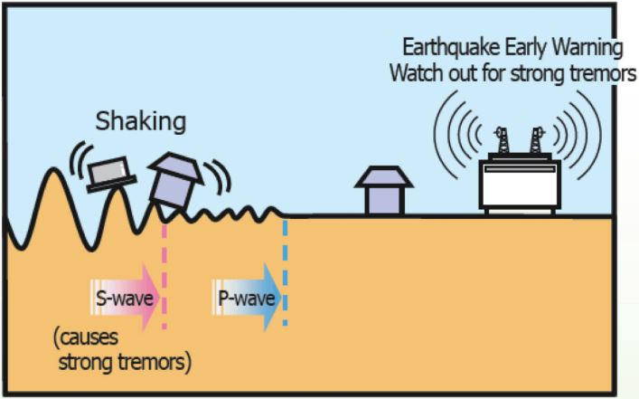
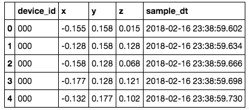
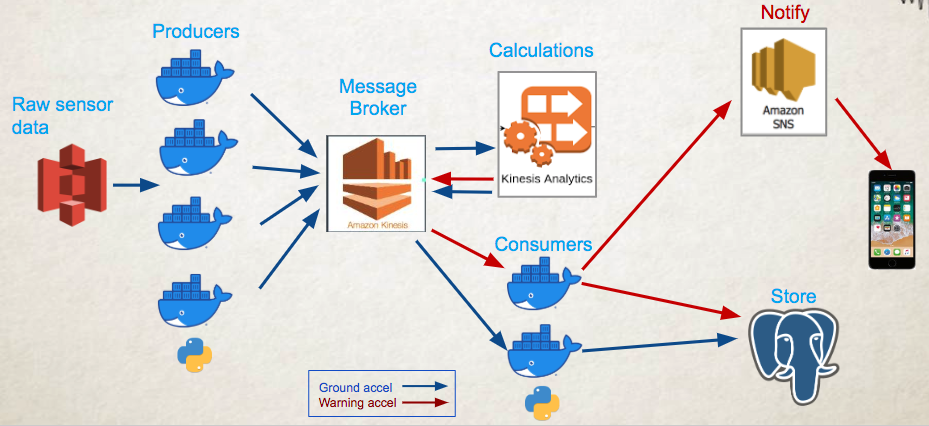

# Be warned: it is coming
## __/Earthquake Early Warning/__

## Project Summary
Currently, it is **impossible to predict** an earthquake. However, recent technological advancements made it **possible to detect** an earthquake when it begins and **to issue an early warning**.
[AWS Kinesis] and [Kinesis Analytis] allow real-time processing of seismic sensors' readings and sending an alert to [AWS SNS] subscribers.  

This project is part of **Data Engineering program** at Insight, Seattle WA (winter session of 2020)

**[[Project Slides](http://bit.ly/2voBMc7)]**

## Background

- Less destructive P waves travel faster than the more destructive S waves, and so will arrive first at any given location.
- A dense seismic station network near the earthquake source can quickly detect seismic waves well before the more significant shaking will arrive at more distant population centers.
- Data transmission to a processing center, and distribution to the end user is very fast relative to seismic travel times.

Primary Earthquake Early Warning recipients include
- Large-Scale Utilities 
- High-Speed Mass Transportation Operators
- Industrial Equipment and Process Operators
- Industrial Chemical Control 
- Activation of Emergency Response Plans

## Data Source

OpenEEW by Grillo ([https://registry.opendata.aws/grillo-openeew/](https://registry.opendata.aws/grillo-openeew/))

- data is generated by seismic sensors located in Mexico 
- data was recorded since December of 2017
- frequency is 32 seismic sensor measurements per second  
- approximate data volume is 900GB
- data is stored in json format

## Data Pipeline

